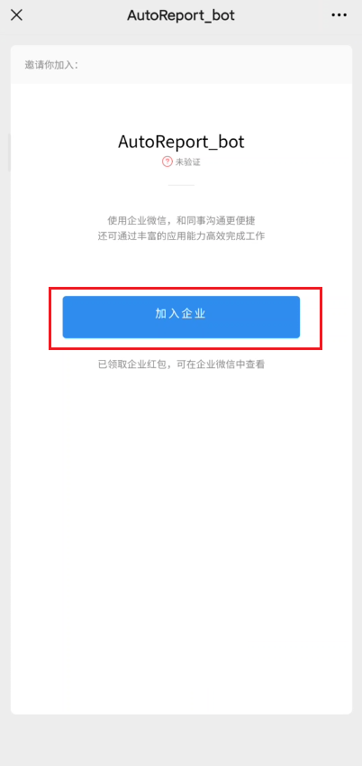
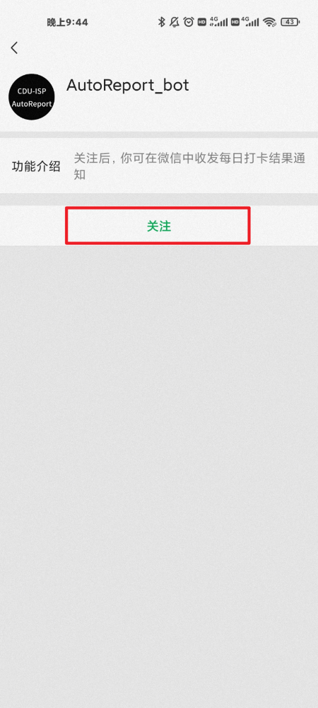

# 一分钟无痛配置微信推送（使用微信打开本页面）

## 1.用微信扫描如下二维码

- PS:若二维码过期，请联系 [benjia.h@qq.com](mailto:benjia.h@qq.com) 更新

## 2.加入企业微信（无需下载企业微信）

## 3.添加微信插件，用微信扫描如下二维码

- 这样就可以在微信APP中获取企业微信的推送，从而无需下载企业微信

- !!注意!!：**如果显示⌈当前企业未验证主体信息，微信插件已达到当日关注人数上限。企业验证主体信息后可继续关注，你也可下载企业微信App使用。⌋请跳过此步，并下载企业微信接收通知。**
- PS:若二维码过期，请联系 [benjia.h@qq.com](mailto:benjia.h@qq.com) 更新

## 4.记录刚刚添加企业时，您的微信名字，并发送给我

## 5.填写信息收集表

- [信息收集表](https://www.wjx.top/vj/rSWVRta.aspx)

## 6.完成
