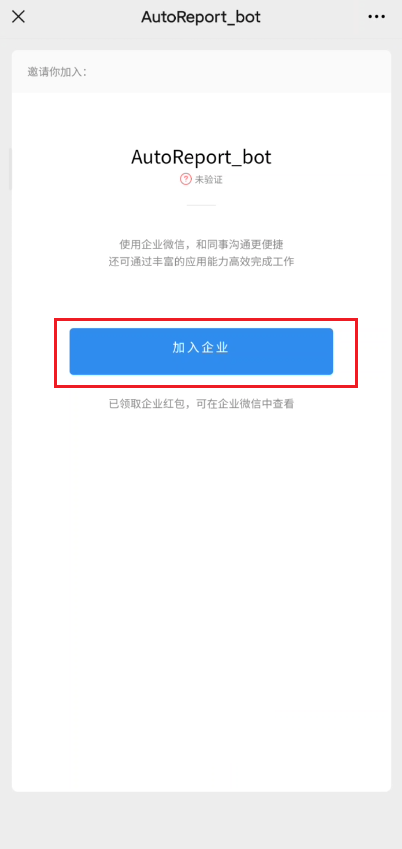

# 一分钟无痛配置微信推送

## 1.用微信扫描如下二维码

或者用微信打开此链接 <https://work.weixin.qq.com/join/KQuIDaIMiHO7yNfkY8jfRQ/hb_share_mng_mjoin>

## 2.加入企业微信（无需下载企业微信）

## 3.添加微信插件，用微信扫描如下二维码

- 这样就可以在微信APP中获取企业微信的推送
- PS:若二维码过期，请联系 benjia.h@qq.com 更新

## 4.记录刚刚添加企业时，您的微信名字

## 5.填写信息收集表

- [信息收集表](https://www.wjx.top/vj/rSWVRta.aspx)
